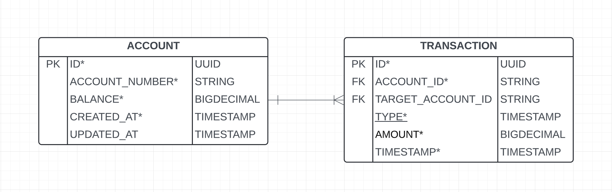

# Banking API

This project is a simple REST API for a banking application. It allows users to create accounts, and perform transactions such as deposits, withdrawals, and transfers.

## Tech Stack

- **Java 17**: The core language used for development.
- **Spring Boot**: Used to create the RESTful web services.
- **Hibernate/JPA**: For ORM and database interactions.
- **H2 Database**: An in-memory database used for development and testing.
- **Lombok**: To reduce boilerplate code.
- **Liquibase**: For database migrations.
- **JUnit & Mockito**: For unit testing.

## Design Choices

### Controllers
- **AccountController**: Manages account-related operations like creating and fetching accounts.
- **TransactionController**: Handles transaction operations like deposits, withdrawals, and transfers.

### Services
- **AccountService**: Contains business logic for account operations.
- **TransactionService**: Contains business logic for transaction operations.

### Exception Handling
- **ApplicationExceptionHandler**: A centralized exception handler that catches and processes various exceptions.

### Database
- **Account and Transaction Entities**: Represent the data model.
- **AccountRepository**: For database operations on the Account entity.
- **TransactionRepository**: For database operations on the Transaction entity.

### Design Patterns
- **Strategy Pattern**: Used in `BankOperation` for different transaction types.
- **DTO Pattern**: Used for transferring data between layers.

## Getting Started

### Prerequisites

- **Java 17**: Ensure Java 17 is installed on your machine.
- **Maven**: Used for building and managing the project dependencies.

### Setting Up Locally

1. **Clone the Repository**

    ```bash
    git clone <repository-url>
    cd banking-api
    ```

2. **Build the Project**

    ```bash
    mvn clean install
    ```

3. **Run the Application**

    ```bash
    mvn spring-boot:run
    ```

### Configuration

The application uses an H2 in-memory database by default. The configuration can be found in the `application.yml` file:

```yaml
spring:
  datasource:
    driver-class-name: org.h2.Driver
    url: jdbc:h2:mem:banking;DB_CLOSE_DELAY=-1;DB_CLOSE_ON_EXIT=FALSE
    username: sa
    password: password
  h2:
    console:
      enabled: true
      path: /h2-console
```

## Database Schema



### API Endpoints

#### Account Endpoints

- **Create Account**
  - **URL**: `POST /api/v1/accounts`
  - **Request Body**:
    ```json
    {
      "initialBalance": 1000.00
    }
    ```
  - **Response**:
    ```json
    {
      "id": "UUID",
      "accountNumber": "123456789012",
      "balance": 1000.00,
      "createdAt": "2023-01-01T00:00:00",
      "updatedAt": "2023-01-01T00:00:00",
      "transactions": []
    }
    ```

- **Get Account by Account Number**
  - **URL**: `GET /api/v1/accounts/{accountNumber}`
  - **Response**:
    ```json
    {
      "id": "UUID",
      "accountNumber": "123456789012",
      "balance": 1000.00,
      "createdAt": "2023-01-01T00:00:00",
      "updatedAt": "2023-01-01T00:00:00",
      "transactions": [
        {
          "id": "UUID",
          "type": "DEPOSIT",
          "amount": 1000.00,
          "timestamp": "2023-01-01T00:00:00"
        }
      ]
    }
    ```

- **Get All Accounts**
  - **URL**: `GET /api/v1/accounts`
  - **Response**:
    ```json
    {
      "content": [
        {
          "id": "UUID",
          "accountNumber": "123456789012",
          "balance": 1000.00,
          "createdAt": "2023-01-01T00:00:00",
          "updatedAt": "2023-01-01T00:00:00"
        }
      ],
      "pageNumber": 0,
      "pageSize": 20,
      "totalElements": 1,
      "totalPages": 1
    }
    ```

#### Transaction Endpoints

- **Deposit**
  - **URL**: `POST /api/v1/transactions/deposit`
  - **Request Body**:
    ```json
    {
      "accountNumber": "123456789012",
      "amount": 500.00
    }
    ```
  - **Response**:
    ```json
    {
      "id": "UUID",
      "account": {
        "id": "UUID",
        "accountNumber": "123456789012",
        "balance": 1500.00,
        "createdAt": "2023-01-01T00:00:00",
        "updatedAt": "2023-01-01T00:00:00"
      },
      "type": "DEPOSIT",
      "amount": 500.00,
      "timestamp": "2023-01-01T00:00:00"
    }
    ```

- **Withdraw**
  - **URL**: `POST /api/v1/transactions/withdraw`
  - **Request Body**:
    ```json
    {
      "accountNumber": "123456789012",
      "amount": 200.00
    }
    ```
  - **Response**:
    ```json
    {
      "id": "UUID",
      "account": {
        "id": "UUID",
        "accountNumber": "123456789012",
        "balance": 800.00,
        "createdAt": "2023-01-01T00:00:00",
        "updatedAt": "2023-01-01T00:00:00"
      },
      "type": "WITHDRAW",
      "amount": 200.00,
      "timestamp": "2023-01-01T00:00:00"
    }
    ```

- **Transfer**
  - **URL**: `POST /api/v1/transactions/transfer`
  - **Request Body**:
    ```json
    {
      "accountNumber": "123456789012",
      "targetAccountNumber": "098765432109",
      "amount": 300.00
    }
    ```
  - **Response**:
    ```json
    {
      "id": "UUID",
      "account": {
        "id": "UUID",
        "accountNumber": "123456789012",
        "balance": 700.00,
        "createdAt": "2023-01-01T00:00:00",
        "updatedAt": "2023-01-01T00:00:00"
      },
      "targetAccount": {
        "id": "UUID",
        "accountNumber": "098765432109",
        "balance": 300.00,
        "createdAt": "2023-01-01T00:00:00",
        "updatedAt": "2023-01-01T00:00:00"
      },
      "type": "TRANSFER",
      "amount": 300.00,
      "timestamp": "2023-01-01T00:00:00"
    }
    ```